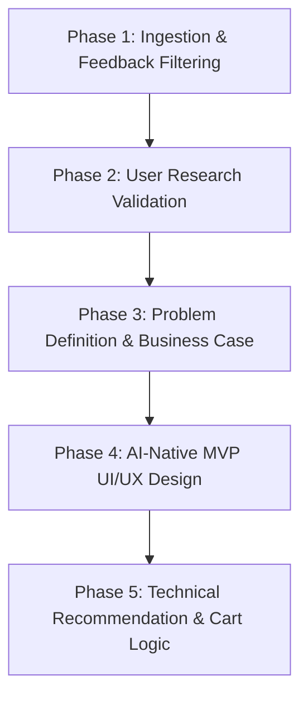

# Swiggy Instamart Solution Architecture: Phase-Wise Blueprint

This document details the complete, phase-wise architecture and design specifications for the **Swiggy Instamart Category Discovery & AI-Powered Growth Engine**. It serves as the master technical blueprint for validating, defining, and building the AI-Native Category Discovery MVP.

---



---

## Phase 1: Opportunity Ingestion & Review Processing
**Objective**: Build a system that parses user feedback at scale to identify category exploration barriers and friction points.

### 1.1 Ingestion Specs
*   **Target Channels**: Play Store & App Store reviews, Reddit discussions (`r/india`, `r/bangalore`, `r/swiggy`), Swiggy Community forums, and social media mentions.
*   **Volume**: Clean and filter reviews to isolate complaints regarding catalog navigation, search failure, lack of product details, and category visibility issues.
*   **Indian Contextualization**: Target localized quick-commerce behaviors (e.g., ordering local snacks, regional spices, organic brands, or comparing Swiggy Instamart with competitors like Blinkit and Zepto).

### 1.2 Analysis Framework (Friction Theme Identification)
1.  **Habitual Lock-in**: Users default to the "Buy Again" page or the search bar directly, bypassing category landing pages.
2.  **Quality Trust Deficit**: Fear of purchasing fresh meats, seafood, or organic produce online; users prefer physical verification.
3.  **Visibility / UI Bloat**: The app homepage is cluttered with discount banners, hiding new categories (e.g., Office Supplies, Pet Care).
4.  **Trial Risk**: Hesitancy to pay full price for a new category item (e.g., trying a new laundry detergent or a gourmet sauce) without knowing if they will like it.
5.  **Information Deficit**: Lack of clarity on ingredients, usage instructions, or sizing for personal care and baby products.

---

## Phase 2: Validate the Opportunity Through User Research
**Objective**: Validate feedback themes through primary qualitative research and define target user personas.

### 2.1 Interview Guide & Cohorts
*   **Cohort**: 5-6 regular quick-commerce users who order at least 3 times a week but purchase from fewer than 3 distinct categories.
*   **Validation Focus**:
    *   *Utility vs. Exploration*: Do users view Instamart purely as an emergency utility (running out of milk/bread) rather than a shopping destination?
    *   *The "Buy Again" Trap*: How heavily do users rely on order history to build their weekly carts?
    *   *Micro-Trial Incentives*: Would a free trial size or a deep discount motivate them to try a new category?
*   **Key Persona**: **"The Routine Replenisher"**—user who knows exactly what they want, values delivery speed above all, and finds browsing catalog categories too time-consuming.

---

## Phase 3: Define the Problem & Business Case
**Objective**: Frame the problem mathematically and detail the business metrics impacted.

### 3.1 Problem Definition
Quick-commerce users exhibit **category stagnation** because the current UX optimizes heavily for speed (highlighting "Ordered Before" and direct search), which reinforces routine purchases and creates a high-friction discovery flow for new categories.

### 3.2 Business Case (Why Solve This?)
*   **Average Order Value (AOV) Boost**: Cross-selling into high-margin categories (like cosmetics, gourmet food, electronics) increases basket size.
*   **Retention & Lifetime Value (LTV)**: Users who buy from multiple categories (e.g., groceries + pet supplies) are significantly less likely to churn to competitors.
*   **Strategic Metric**: **Monthly Active Category Penetration Rate (MACPR)**—increasing the number of users who purchase from $\ge 1$ new category every 30 days.

---

## Phase 4: AI-Native MVP UI/UX Design
**Objective**: Build a premium, high-fidelity mock interface replicating Swiggy Instamart's styling (`#FC8019` orange, card grids, bottom navigation) with three integrated growth features:

### 4.1 "Chef-in-Cart" (AI Recipe-to-Basket Builder)
*   A conversational chat assistant on the cart page. 
*   **User flow**: User types: *"I want to make Red Sauce Pasta."*
*   **AI response**: Adds pasta (grocery) to the cart, but also prompts the user to add gourmet basil pesto (gourmet category), parmesan cheese (dairy category), and stainless steel tongs (kitchenware category).
*   **Impact**: Cross-sells three categories in a single tap.

### 4.2 "Insta-Discovery Wheel" (Gamified Trial)
*   A wheel widget on checkout. If the cart contains a product from a category the user has **never purchased** (or hasn't in 90 days), they unlock a free spin.
*   **Rewards**: 50% off that new category item, or a free trial sample.

### 4.3 Contextual "Category Complements"
*   Replaces generic recommendations with LLM-generated explanations for *why* an item from a new category is suggested (e.g. *"Since you bought premium coffee beans, try this Hazelnut Syrup from Gourmet Essentials to upgrade your morning cup."*).

---

## Phase 5: Technical Recommendation & Cart Logic
**Objective**: Map current cart items to un-explored categories and rank them dynamically.

### 5.1 Recommendation Routing Logic
```
[User Cart: Coffee Beans] ──> [LLM Context Router] ──> Filter: Low-Penetration Categories
                                                      │
                                                      └──> Result: [Gourmet Syrup, Coffee Mug]
```

### 5.2 Category Mapping Matrix
| Cart Trigger | Un-explored Category | Suggested Cross-Sell | LLM Contextual Hook |
| :--- | :--- | :--- | :--- |
| **Fresh Vegetables** | **Gourmet / Spices** | Extra Virgin Olive Oil / Oregano | "Upgrade your salads with organic cold-pressed oil." |
| **Milk & Bread** | **Baby Care / Pet Care** | Baby Wipes / Dog Treats | "Did you know we now stock essentials for your little ones?" |
| **Snacks & Cola** | **Personal Care** | Face Wipes / Lip Balm | "Keep refreshed after your snacks!" |
| **Washing Liquid** | **Home Utility** | Drawer Organizers / Trash Bags | "Complete your home cleaning setup." |
