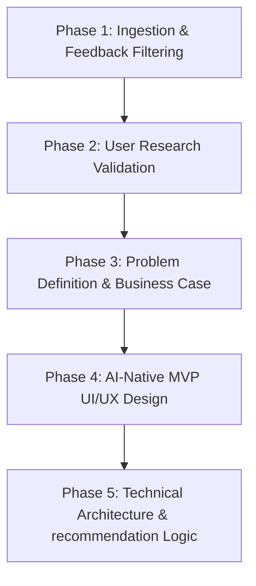

# Spotify Solution Architecture: Phase-Wise Blueprint

This document details the complete, phase-wise architecture and design specifications for the **Spotify "Loop Breaker" & Music Discovery Solution**. It serves as the master technical blueprint for validating, defining, and building the AI-Native Music Discovery MVP.

---



---

## Phase 1: Opportunity Ingestion & Review Processing
**Objective**: Build a system that analyzes feedback to identify recommendation failures, focusing on repetitive loop traps and discovery fatigue.

### 1.1 Ingestion Specs
* **Target Channels**: Google Play Store reviews, Apple App Store reviews, Reddit discussions (`r/truespotify`), and Spotify Community Forums.
* **Volume**: Filter and clean reviews down to a representative dataset focused strictly on recommendation and discovery issues (excluding billing, login, or network issues).
* **Indian Contextualization**: Target reviews indicating preferences for a blend of regional (Hindi, Tamil, Malayalam, Punjabi, Telugu) and global English music, highlighting local discovery challenges.

### 1.2 Analysis Framework
* **Theme Identification**: Extract recurring complaints around:
  1. *Echo Chambers*: The algorithm repeating the same 30-40 songs across all daily mixes.
  2. *Discover Weekly Fatigue*: Algorithmic recommendations being "too safe" or over-optimized for past streams.
  3. *Lack of Contextual Steering*: No way to tell Spotify "I'm in a rainy mood, don't play my usual gym pop."

---

## Phase 2: Validate the Opportunity Through User Research
**Objective**: Ground the feedback themes in primary qualitative research by defining interview parameters.

### 2.1 Interview Guide
* **Cohort**: 5-6 Spotify power users (listening 15+ hours/week) experiencing recommendation boredom.
* **Core Questions**:
  * "When you want to find new music, what actions do you take?"
  * "How does your current geographic location, weather, or current mood affect what you want to hear?"
  * "Why do you think you revert to your comfort playlists?"
  * "If you are not a native of your current GPS location, how should the app balance local language tracks with your historical language preferences?"
* **Validation Outcome**: 
  * Map out the core user profile: **"The Active Curation Seeker"**—users who actively want to discover new music but find the friction of searching manually too high, reverting to repeats out of convenience.
  * **Non-Native Language Behavior**: Ground research shows that if a user is not a native of their current physical location (e.g. an expat or traveler), recommending songs in the local dialect creates friction. The system must verify if the user's playlist history matches the local language. If not, it must pivot to the majority language of their past streams.

---

## Phase 3: Define the Problem & Business Case
**Objective**: Articulate the core problem, target segments, and business metrics.

### 3.1 Problem Framing
* **The Root Cause**: Traditional collaborative filtering models optimize heavily for *implicit engagement time* (clicks and retention). This creates feedback loops: because you click familiar songs, the model thinks you only want those, leading to an echo chamber.
* **The Solution Concept**: Transition from *implicit history tracking* to *explicit contextual steering* using real-time factors: **Location-based Weather**, **Local/Preferred Languages**, and **Interactive Moods**.
* **Business Metric Impact**:
  * **Primary Success**: Increase *Discovery Rate Index* (percentage of daily streams from artists new to the user).
  * **Retention Guardrail**: Decrease playlist churn and reduce user drift to alternative music discovery sources (TikTok, YouTube).

---

## Phase 4: AI-Native MVP UI/UX Design
**Objective**: Implement a high-fidelity, interactive mock interface that replicates Spotify's layout and integrates the new conversational discovery engine.

### 4.1 Interface Layout
* **Dashboard Theme**: Sleek dark interface matching Spotify's design system (`#121212` background, `#1DB954` green highlights, circular avatars, and modern card grid).
* **Floating Discovery Placement**: A floating button in the **bottom-right corner** with a pulsing notification badge reading: *"Break your loop! ⚡"*.
* **Slide-In Chatbot Widget**: Clicking the button opens a slide-in chat panel with:
  * Location & Weather detection card (e.g. *"📍 Bangalore • Rainy & Cozy"*).
  * Auto-determined language selector (e.g. *"Majority language: Hindi & English"*).
  * Conversational chat bubble greeting the user.
* **Mood Selection Overlay Pop-Up**: Triggered during the chat flow, requesting the user to select their current mood via interactive visual cards:
  * 😌 **Cozy / Chill** (low energy, warm)
  * ⚡ **Energetic / Pumped** (high energy, fast)
  * 😢 **Melancholic / Nostalgic** (acoustic, soft, minor scale)
  * 🚀 **Focused / Productive** (ambient, instrumental, steady tempo)
  * 💃 **Party / Dance** (high energy, driving rhythm)

---

## Phase 5: Technical Architecture & Recommendation Logic
**Objective**: Map context inputs (Weather, Language, Mood) to target audio attributes and generate loop-breaking recommendations.

### 5.1 Recommendation Engine Flow
```
[User Context: Location & Weather] ──┐
                                     ├──> [AI Context Router] ──> [Filtered Recommendations]
[User Profile: Preferred Languages] ──┤
                                     │
[Active Input: Selected Mood] ───────┘
```

### 5.2 Mapping Matrix (Weather + Mood to Audio Parameters)
The local music catalog (`catalog.json`) is filtered using specific audio attributes:
* **Valence**: Measures musical positiveness (0.0 to 1.0).
* **Energy**: Measures intensity and activity (0.0 to 1.0).

| Weather + Mood Combo | Target Valence | Target Energy | Target Style / Genre |
| :--- | :--- | :--- | :--- |
| **Rainy + Cozy/Chill** | 0.40 - 0.60 | 0.30 - 0.50 | Acoustic, Soft Melodies, Indie |
| **Sunny + Energetic** | 0.75 - 0.95 | 0.80 - 1.00 | Upbeat Pop, High-tempo Dance |
| **Overcast + Melancholic**| 0.15 - 0.35 | 0.20 - 0.40 | Sad Indie, Ghazals, Classical |
| **Cold + Focused** | 0.50 - 0.70 | 0.35 - 0.55 | Low-fi, Instrumental Jazz, Soft Ambient |
| **Any + Party/Dance** | 0.80 - 1.00 | 0.85 - 1.00 | Electronic, Punjabi Pop, Club Mixes |

### 5.3 Loop-Breaker Exclusion Layer
* To guarantee "new song" discovery and avoid repetitive tracks, the engine cross-references the user's mock "Recently Played" history and excludes any track with >90% match to recent artist list, forcing the catalog to pull outside their high-frequency pool.
